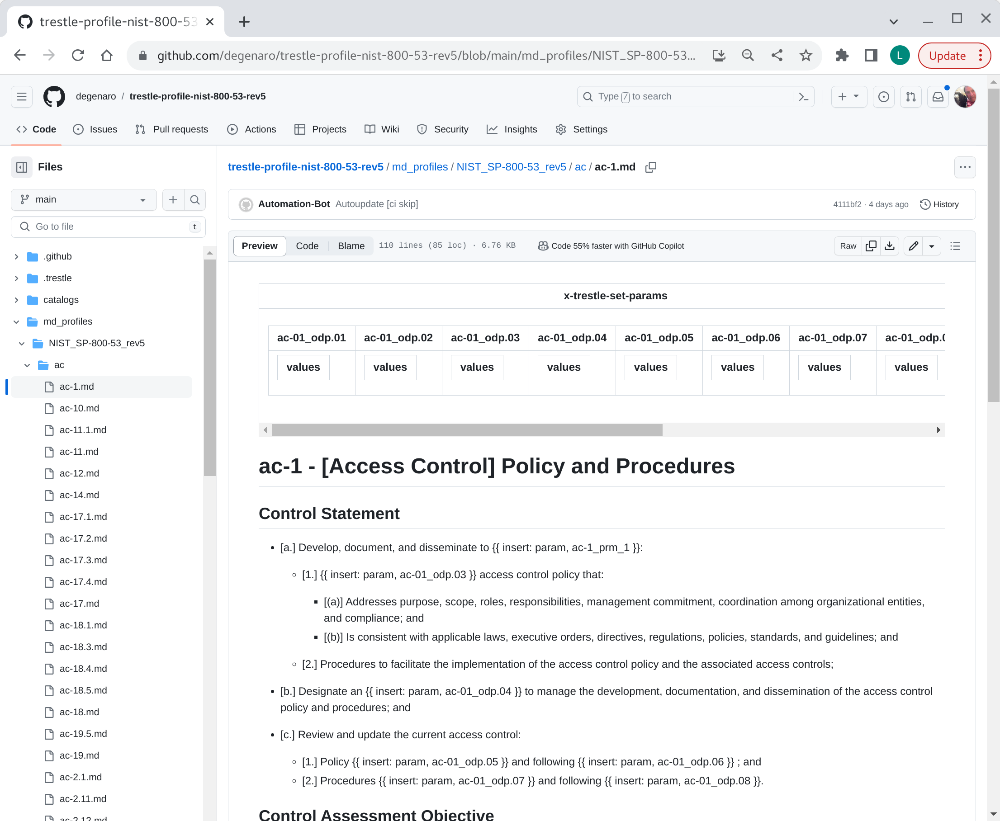
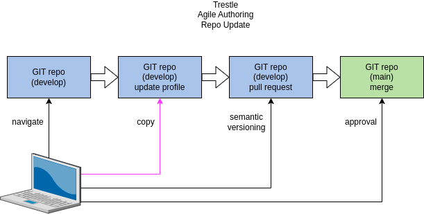
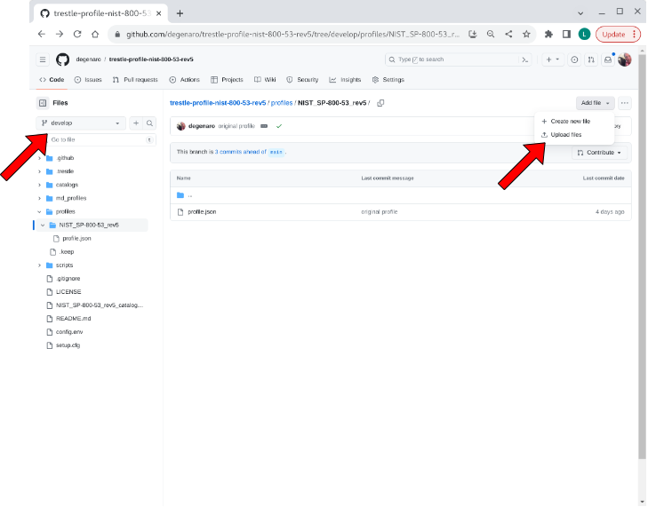
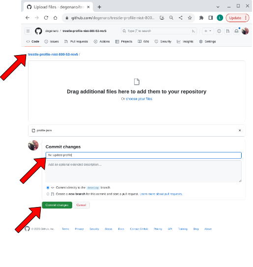
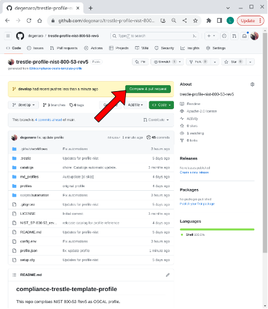
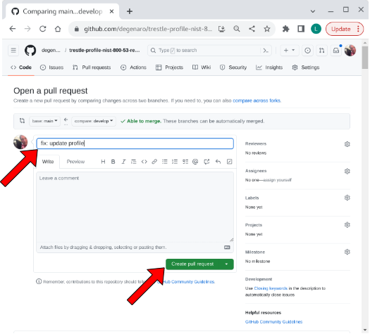
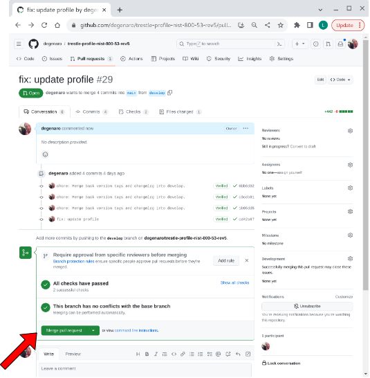
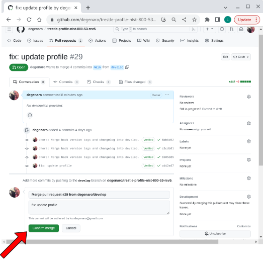

## compliance-trestle-profile

compliance-trestle repository for agile authoring of profile

Prerequisite: [profile template](https://github.com/IBM/compliance-trestle-template-profile) has been used to [create profile repo](https://github.com/IBM/compliance-trestle-agile-authoring/blob/main/README.create-repo-profile.md) for agile authoring.

- [view profile markdown](#view-profile-markdown)
- [update profile](#update-profile)

-----

##### view profile markdown

Navigate to the `md_profiles` folder, then descend to the control of interest.

visual

-----

##### update profile

Steps to modify the profile repository with an updated profile are given below:

###### 1. navigate to develop branch location of profile in repo.

visual

###### 2. copy updated profile to repo.

visual

###### 3. compare & pull request

visual

###### 4. create pull request

visual

###### 5. merge pull request

visual

###### 6. confirm merge

visual

-----

##### references

- [documentation: setup profile repo](https://github.com/IBM/compliance-trestle-agile-authoring/blob/main/README.create-repo-profile.md)

- [documentation: agile authoring](https://github.com/IBM/compliance-trestle-agile-authoring#compliance-trestle-agile-authoring)

